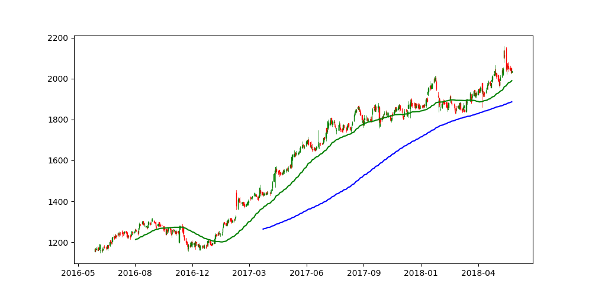
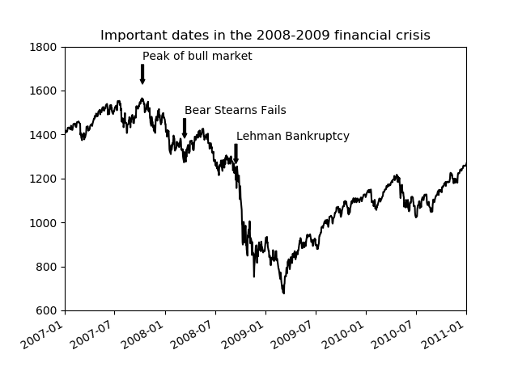

# 🐍 Pandas Python Data Analysis Playground 📊📈
🐍 Data Analysis with the Pandas Library 📊📈

## Installation Pandas ⬇️ 
The easiest way to install Pandas is with pip. Type in your console:
```
pip install pandas
```

## Load DataFrame from a CSV File 📂
Load a DateFrame from a CSV File. (Method .read_csv("your_csv_file.csv"))
```
import pandas as pd

df = pd.read_csv("new_york_city.csv")
```

## Print Rows from a Dateframe using an Integer Index 🗃
Print 10 Rows from a Dateframe using an Integer Index from 10-20. (Method .iloc[from:to])
```
# Print 10 Rows from Dateframe with Integer Index from 10-20
print(df.iloc[10:20])
```

## Print the first Rows from a Dateframe 🗃
Print the first 10 Rows from a Dateframe. (Method .head(amount))
```
# Print the first 10 Rows from the Dateframe
print(df.head(10))
```

## Print Rows from a Dateframe and sort them with an attribute 🗃
Print 10 Rows from a Dateframe using an Integer Index from 0-10 and sort them with an attribute. (Method .sort_values(["Start Time"]))
```
# Prints the first 10 Rows, sorted by Start Time
print(df.iloc[0:10].sort_values(["Start Time"]))
```

## Print 10 random Rows from a Dateframe 🗃
Print 10 random Rows from a Dateframe. (Method .sample(amount))
```
# Print 10 random Rows from a Dateframe
print(df.sample(10))
```

## Create Data Frame 🗂
```
# Create data for the Data Frame
data = {'state': ['Ohio', 'Ohio', 'Ohio', 'Nevada', 'Nevada', 'Nevada'],
        'year': [2000, 2001, 2002, 2001, 2002, 2003],
        'pop': [1.5, 1.7, 3.6, 2.4, 2.9, 3.2]}

# Create Data Frame
df = pd.DataFrame(data)
```

## Draw Candlestick Chart with moving averages 📈

<p align="center">
  
</p>

```
import pandas as pd
import matplotlib.pyplot as plt
import datetime
from mpl_finance import candlestick_ohlc
import matplotlib.dates as mdates

df = pd.read_csv('candlestick_chart.csv')

# ensuring only equity series is considered
df = df.loc[df['Series'] == 'EQ']

# Converting date to pandas datetime format
df['Date'] = pd.to_datetime(df['Date'])
df["Date"] = df["Date"].apply(mdates.date2num)

# Creating required data in new DataFrame OHLC
ohlc= df[['Date', 'Open Price', 'High Price', 'Low Price','Close Price']].copy()
# In case you want to check for shorter timespan
# ohlc =ohlc.tail(60)
# ohlc['SMA50'] = ohlc["Close Price"].rolling(50).mean()

f1, ax = plt.subplots(figsize = (10,5))

# plot the candlesticks
candlestick_ohlc(ax, ohlc.values, width=.6, colorup='green', colordown='red')
ax.xaxis.set_major_formatter(mdates.DateFormatter('%Y-%m'))

# Creating SMA columns
ohlc['SMA5'] = ohlc["Close Price"].rolling(5).mean()
ohlc['SMA10'] = ohlc["Close Price"].rolling(10).mean()
ohlc['SMA20'] = ohlc["Close Price"].rolling(20).mean()
ohlc['SMA50'] = ohlc["Close Price"].rolling(50).mean()
ohlc['SMA100'] = ohlc["Close Price"].rolling(100).mean()
ohlc['SMA200'] = ohlc["Close Price"].rolling(200).mean()

# Plotting SMA columns
# ax.plot(ohlc['Date'], ohlc['SMA5'], color = 'blue', label = 'SMA5')
# ax.plot(ohlc['Date'], ohlc['SMA10'], color = 'blue', label = 'SMA10')
# ax.plot(ohlc['Date'], ohlc['SMA20'], color = 'red', label = 'SMA20')
ax.plot(ohlc['Date'], ohlc['SMA50'], color = 'green', label = 'SMA50')
# ax.plot(ohlc.index, df['SMA100'], color = 'blue', label = 'SMA100')
ax.plot(ohlc['Date'], ohlc['SMA200'], color = 'blue', label = 'SMA200')

plt.show()
```

## Draw financial Chart 💹

<p align="center">
  
</p>

```
import pandas as pd
import matplotlib.pyplot as plt
import matplotlib
from datetime import datetime

fig = plt.figure()
ax = fig.add_subplot(1, 1, 1)

data = pd.read_csv('spx.csv', index_col=0, parse_dates=True)
spx = data['SPX']

spx.plot(ax=ax, style='k-')

crisis_data = [
    (datetime(2007, 10, 11), 'Peak of bull market'),
    (datetime(2008, 3, 12), 'Bear Stearns Fails'),
    (datetime(2008, 9, 15), 'Lehman Bankruptcy')
]

for date, label in crisis_data:
    ax.annotate(label, xy=(date, spx.asof(date) + 75),
                xytext=(date, spx.asof(date) + 225),
                arrowprops=dict(facecolor='black', headwidth=4, width=2,
                                headlength=4),
                horizontalalignment='left', verticalalignment='top')

# Zoom in on 2007-2010
ax.set_xlim(['1/1/2007', '1/1/2011'])
ax.set_ylim([600, 1800])

ax.set_title('Important dates in the 2008-2009 financial crisis')

fig.show()
```


